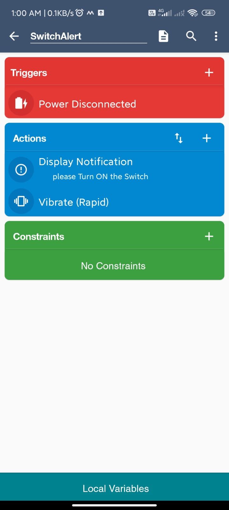

# SWITCHALERT - SMART CHARGING ALERT SYSTEM

## PROJECT OVERVIEW
SwitchAlert is an Android-based automation project that detects when a charger is connected but no power is supplied (switch OFF condition).

## WORKING PRINCIPLE 
- Trigger: Power Disconnected
- Actions: Show Notification and Vibrate

## FEATURES
- Real-time alert system
- Works without coding using MacroDroid
- Lightweight and efficient

## TOOLS USED
- MacroDroid (Android Automation App)

## USE CASE
This project helps users avoid situations where the phone is plugged in but not charging due to switch OFF or loose connection.

## CONCLUSION
SwitchAlert provides a simple and effective solution for a common real-life problem using automation logic.

## 

### MACRO SETUP

### OUTPUT NOTIFICATION

